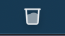

# MiniBinMac

## Мини корзина в трее для MacOs


## Меню приложения


### Кнопка "очистить" очищает корзину


### Кнопка "Выход" закрывает приложение


## Состояния




## Установка

### Автоматическая установка

```bash
git clone https://github.com/MiniBinMac
cd MiniBinMac
make install
```

### Ручная установка

```zsh
git clone https://github.com/MiniBinMac
cd MiniBinMac
chmod +x install.sh
./install.sh
```

## Запуск

### Исполняемый файл назодится в `MiniBinMac/bin/minibinmac`

### Установщик `install.sh` переносит его по пути `/usr/local/bin/` и `opt/local/bin/` , вы можете добавить исполняемый фал в **объекты входа**


### теперь приложение будет автоматически запускаться при входе в систему

### Поддержка


| OS        | Tested    |  
| ----------- | -----------|
| **Mac OS Ventura**      | :white_check_mark:   |
| **cat**     | :x:   |
| **clear**   | :x:    |

<p align="center">2023 © <a href="https://github.com/Avdushin" target="_blank">AVDUSHIN</a></p>